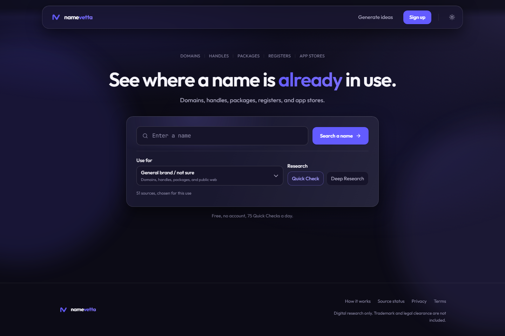
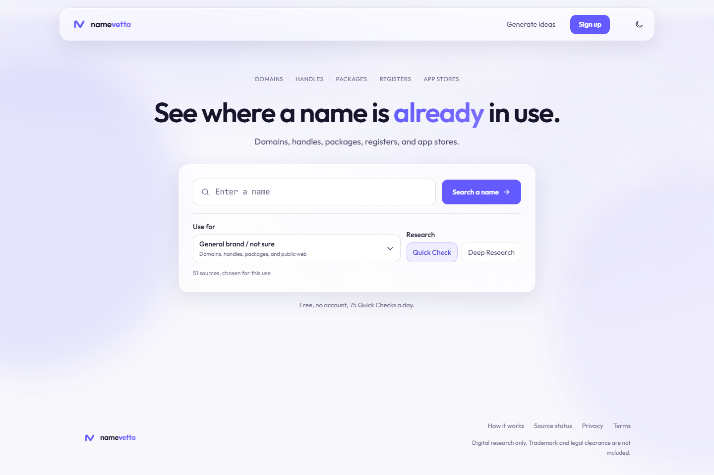
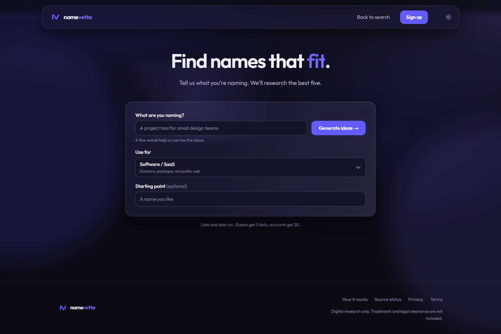

  

<h1 align="center">NameVetta</h1>

Research where a name is already in use.

<a href="https://namevetta.vercel.app">Open NameVetta</a>

NameVetta helps founders, makers, and teams research a name before they commit to it. It brings together useful signals across domains, public platforms, code registries, business surfaces, and app stores, then clearly separates findings from checks that still need a person to verify them.

## What it does

- Research a candidate name with a Quick Check or deeper research pass.
- Generate a short list of considered name ideas from a real brief.
- Show exact conflicts, close matches, clear checks, manual checks, and sources that were intentionally not searched for the selected use.
- Keep saved research in one place for signed-in users.

## Built for honest research

A clear result means a source completed a relevant check without finding a conflict. It does not mean legal clearance or guaranteed availability. If a platform cannot answer reliably, NameVetta keeps it manual or marks it as unverified instead of treating uncertainty as clear.

## A look at the product

| Search a name | Generate ideas |
| --- | --- |
|  |  |

## How it works

1. Choose what you are naming.
2. NameVetta selects relevant research sources.
3. Review findings, evidence, and anything that needs direct verification.

See the live [source status](https://namevetta.vercel.app/status) page for the current catalog and how each source is used.

## Technology

The product is built with Next.js, TypeScript, React, Supabase, and Vercel. Research runs server-side and is normalised into a strict result model so the report can distinguish evidence from uncertainty.

The diagram in [docs/architecture.md](docs/architecture.md) shows the public, high-level flow.

## Status and feedback

NameVetta is live at [namevetta.vercel.app](https://namevetta.vercel.app). Feedback and reproducible product issues are welcome through this repository's [issues](https://github.com/Gr33nOps/namevetta/issues).

## Proprietary project

This repository is a public product showcase. The application source code, source orchestration, internal rules, and operational configuration are maintained separately in a private repository. No open-source licence is granted for the private application or its implementation.

For security reports, read [SECURITY.md](SECURITY.md).
