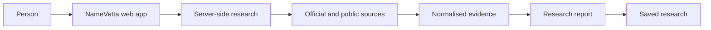

# Product architecture

This repository documents the public shape of NameVetta. It deliberately omits private implementation details, provider configuration, source-specific rules, scoring weights, and operational controls.

The report keeps three things separate:

- verified research results from sources that can answer reliably
- public discovery evidence that may be useful to review
- direct, manual verification for platforms without a trustworthy public availability check

That distinction is central to the product. A failed, skipped, blocked, or ambiguous source is never presented as a clear result.

The live [source status](https://namevetta.vercel.app/status) page shows the current public catalog and source modes.
